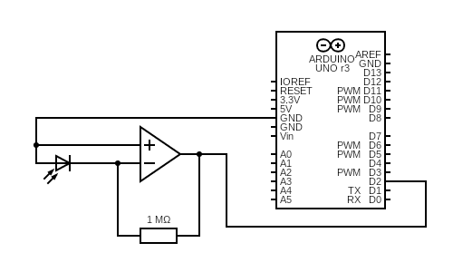
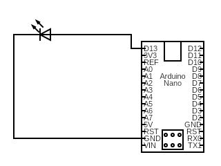

# pws-lifi

## Installation
There are some problems with running this in windows. Mac and Linux usually work fine.
Packages needed:
```
pip3 install pyserial
```

## Hardware setup
The following components were used to make the circuits in the images below.
* [Photodiode](https://www.conrad.nl/p/osram-fotodiode-5-mm-1100-nm-75-sfh-203-p-154029)
* [Laser](https://www.conrad.nl/p/laserfuchs-lasermodule-punt-rood-1-mw-lfd650-1-129x20-816476)
* [Opamp](https://www.conrad.nl/p/microchip-technology-mcp6002-ip-lineaire-ic-operational-amplifier-multifunctioneel-pdip-8-651489)
* Arduino Uno and Arduino Nano (Most Arduino's will work)



Circuit for receiver.





Circuit for transmitter (Laser is pictured as LED).


## Quick start - transmitting files

### Configuration
First open constants.py and change these lines to point to the path of your devices. The default path is resembles the path used by macOS, for windows it is usually something like ```COM5``` and for linux ```/dev/tty5 ```. You can find this path by using the Arduino IDE.
```python
RECEIVINGDEVICE = '/dev/cu.usbmodem14201'
SENDINGDEVICE = '/dev/cu.usbserial-14120'
```
The default input and output ```input.html``` and ```output.html``` can also be changed here, as well as other parameters.

### Starting the transmission

Open a terminal on the receiving device and run:
```
python3 receivingPC.py
```

Open a terminal on the sending device and run:
```
python3 sendingPC.py
```

## Quick start - live typing
Follow the configuration steps for transmitting files above. Then open a terminal on the receiving device and run:
```
python3 receivingLive.py
```

open a terminal on the sending device and run:
```
python3 sendingLive.py
```

## Code usage
If you wish to recreate or improve this product, you can use the functions defined in ```send.py``` and ```receive.py```, they provide functions at multiple levels of complexity. To use these, import them in your programs
```python
import receive
import send
```

### Sending
To send a frame in the simplest way, use this function, passing a payload and a frameNumber. The payload should be a ```PAYLOADLENGHT / 8 - PARITYLENGHT / 8``` long UTF-8 string. The framenumber should be an integer.   
```python
send.sendFrame(payload, frameIndex)
```

To send individual parts of a frame use the ```repeatInterval(callBack, count, argument)``` function, this calls the passed callback funtion ```count``` times and passes ```argument``` along if an argument is provided. Example:
```python
send.repeatInterval(packetNumber, 16, 6)
```
functions that can be passed as callback here are ```send.frameGap```, ```send.preamble```, ```send.packetNumber``` and ```send.payload```.

### Receiving
To receive a frame in the simplest way, use this function, it returns a boolean ```received``` that is true if a frame was received, another boolean ```frameCorrect``` that is true if the frame is validated as correct, an integer ```frameNumber``` and a string ```payload```.
```python
received, frameCorrect, frameNumber, payload = receive.readFrame()
```

To let the device find the start of a frame, use this funtion, it returns a boolean ```received``` that is true if a frame is found before the timeout is reached. (```Flipped``` is a legacy variable that isn't used anymore and will be removed)
```python
received, flipped = receive.findFrameStart()
```

To receive a payload, use the ```readPayload()``` function, it returns a binary payload string (including parity bits). Check if the frame is correct with the ```checkFrame()``` function this returns a boolean ```frameCorrect``` that is true if the frame is correct and a string ```binFrame``` that is the same string that is passed, later it might change so the returned frame has corrected errors. The frame can be converted to text by using ```decode_binary_string()```. Example (the frame number is still in the payload and is not correctly parsed in this example):
```python
received, flipped = receive.findFrameStart()
binFrame = receive.readPayload()
receive.decode_binary_string(binFrame)
```


## Roadmap
The first thing on the roadmap is rewriting the codebase, this is currently being done on the stateFull branch. Another thing is to add bidirectional communication, there is already a bit of commented code in ```sendingPC.py``` for receiving acknowledgements. 
